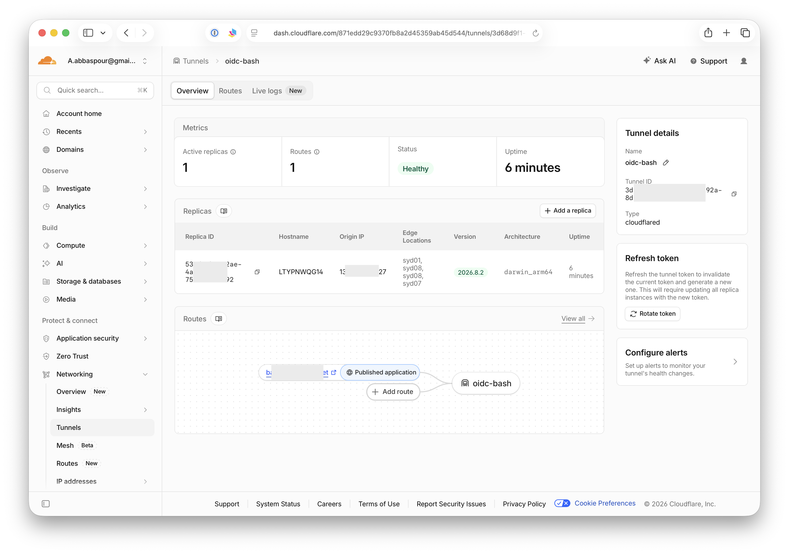

# Cloudflare Tunnel Setup

## Step 1 -  Setup in Cloudflare Dashboard
Go to Cloudflare Dash > Networking > Tunnels > + Create Tunnel

## Step 2 - Populate Env Variable

Edit `.env` file in `web/` folder with tunnel's ID and hostname

```properties
TUNNEL_ID=xxxx
TUNNEL_HOSTNAME=xxx
```

## Step 3 - Populate Tunnel Token

Edit `.tunnel-token` file in `web/` folder with tunnel's token.

```properties
eyJhIjoiODxxxxFeCJ9
```

## Step 4 - Run tunnel

```shell
cd web
make tunnel
```

# Screenshot
