# Setup

Follow Auth0 XAA setup guide [here](https://auth0.com/docs/secure/call-apis-on-users-behalf/xaa).

## Setup 1 - Setup Federation Between Auth0 (SP) and Okta (IdP)

### Setup 1a - Okta IdP OIDC App (Todo0) 
Create a OIDC App in Okta. Use XAA Resource App template from App Catalog. **Your redirect URI** is Auth0 domain `/login/callback`

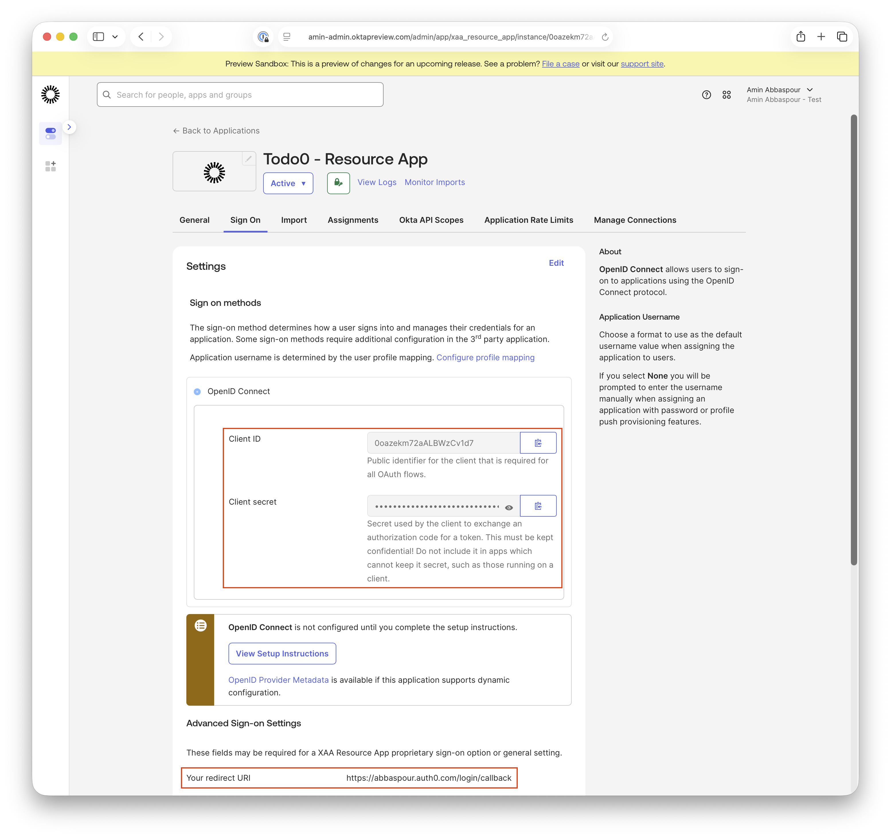

### Setup 1b - Auth0 SP
Create Okta Workforce Connection in Auth0. Named it `xaa-idp` for this demo.

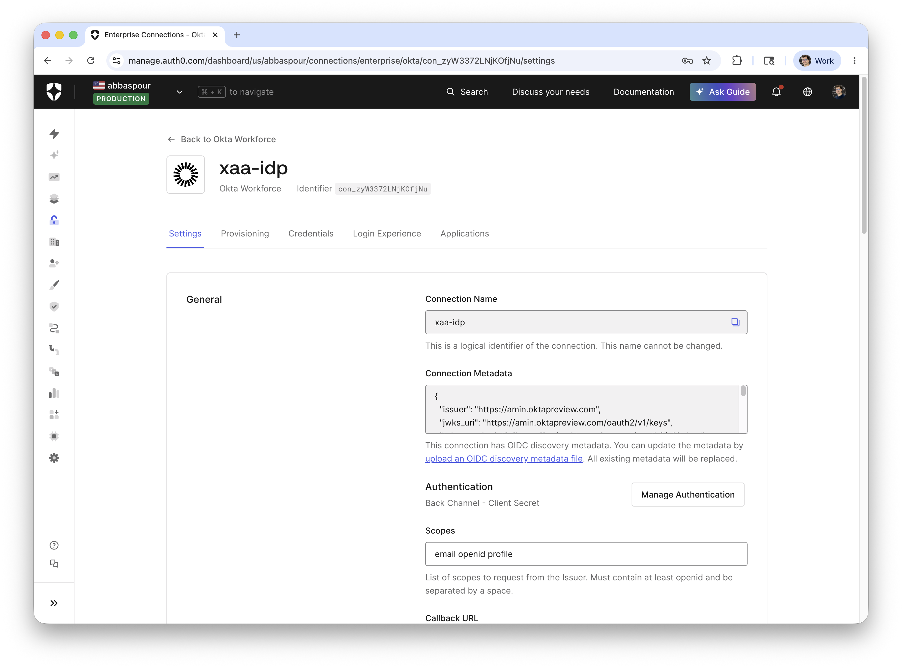

Use **Client ID** and **Client secret** from 1a.

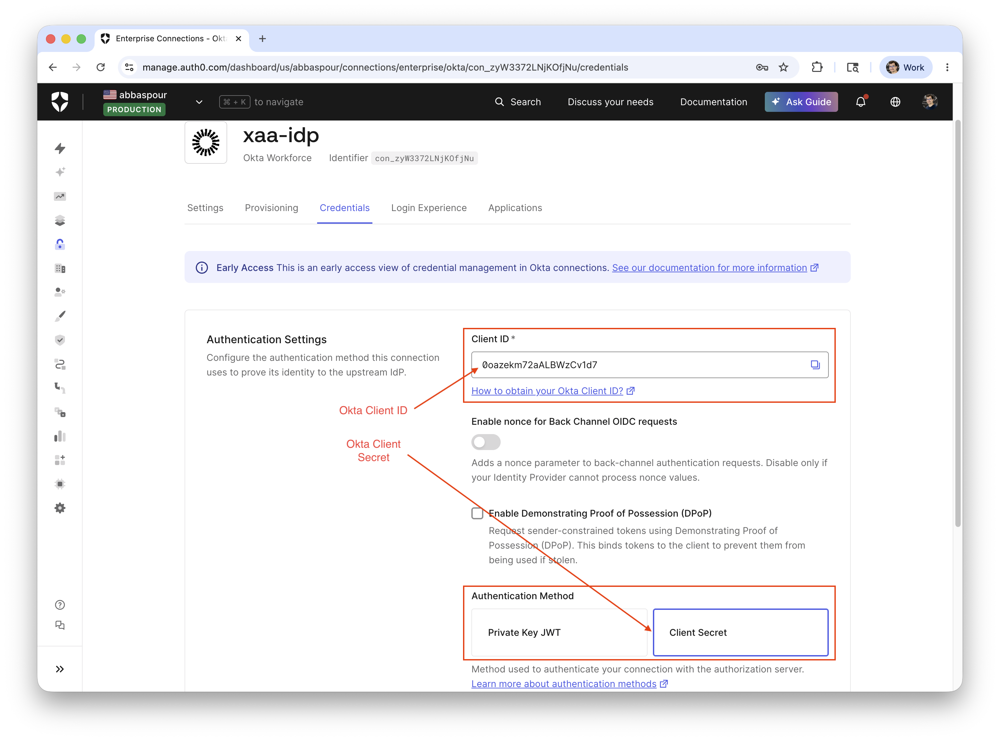

Turn on **Resource Application** under **Cross App Access**.

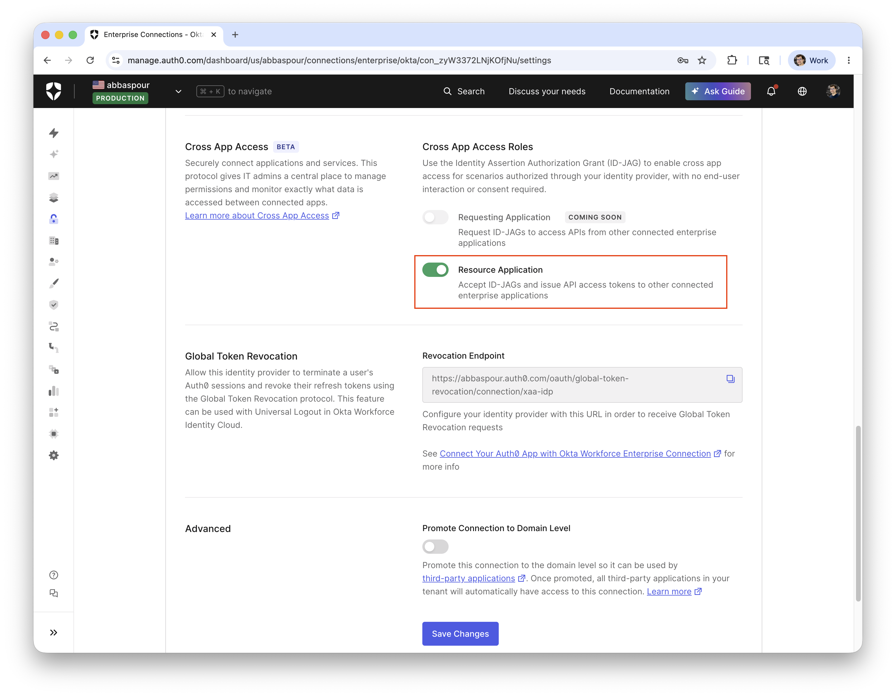

## Setup 2 - Create Resource in Auth0
Under Applications > APIs, with **Identifier** `urn:todo0:api`

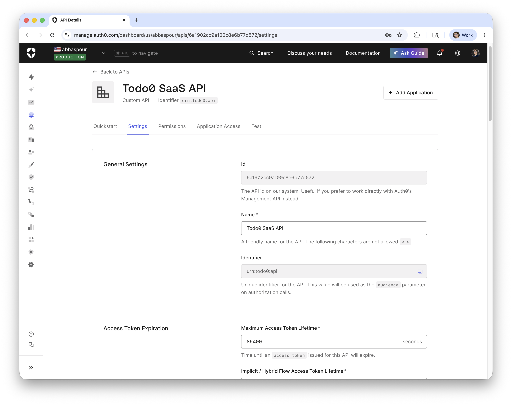

## Step 3 - Create Requesting App (Agent0) in Auth0
Under Applications > Applications, create a confidential regular web application client.

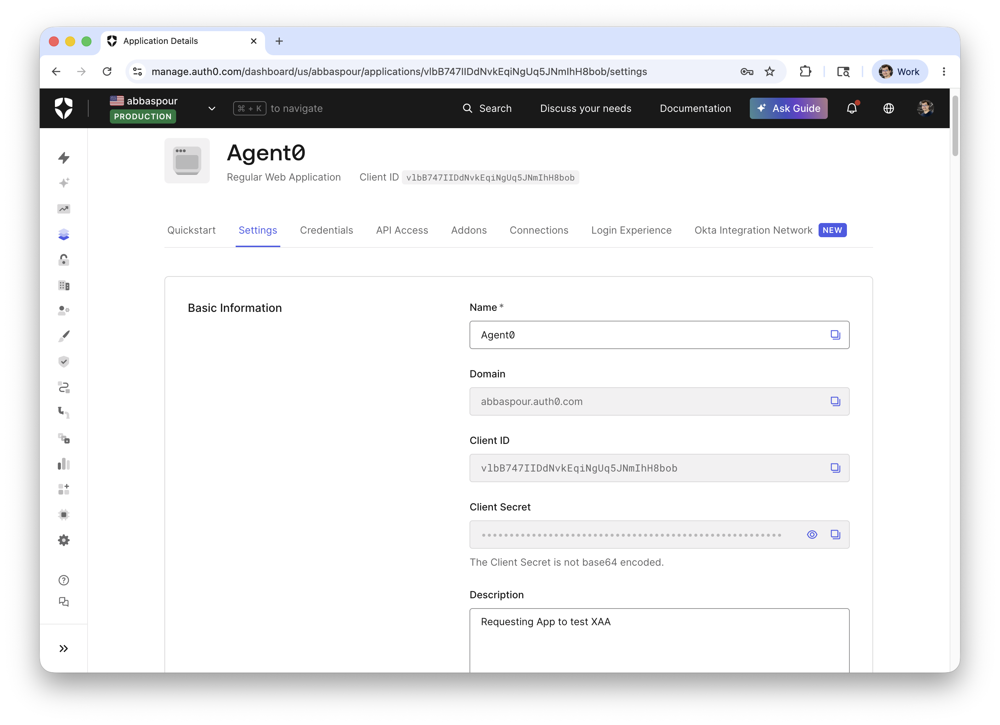

with **Allowed Callback URLs** including `http://localhost:3000/cb`

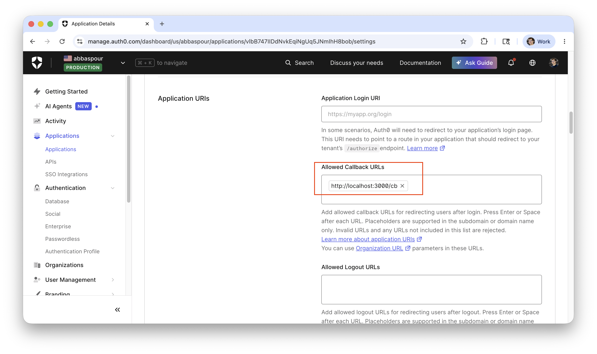

Connected to Okta Workforce Connection from step 1b.

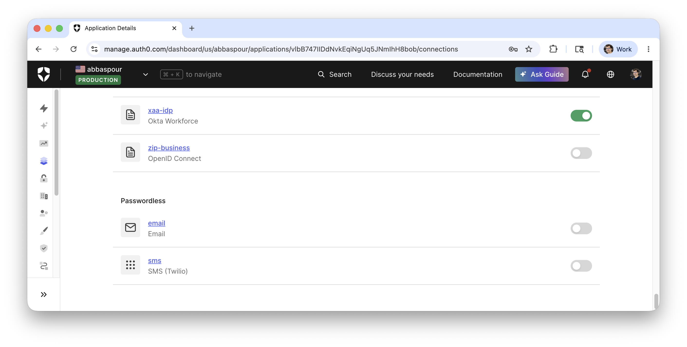

## Step 4 -  Create Requesting App (Agent0) in Okta
Use XAA Resource App template from App Catalog. 
Under **App Settings** set **Client ID** to Auth0 Requesting app client_id from step 3.

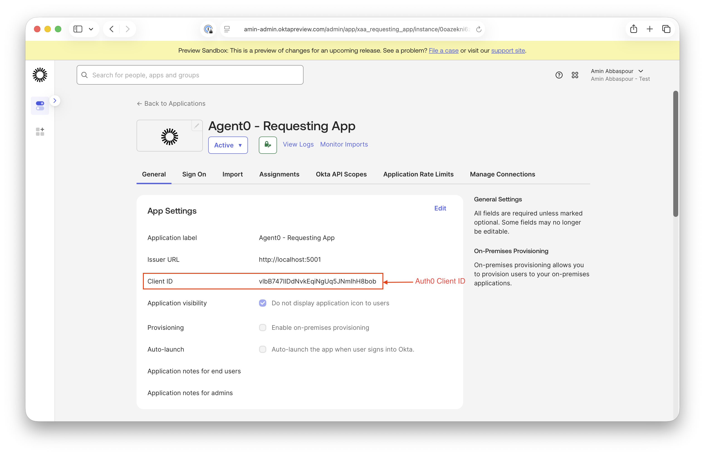

Under **Manage Connections** connect this app to `Todo0` from Step 1.

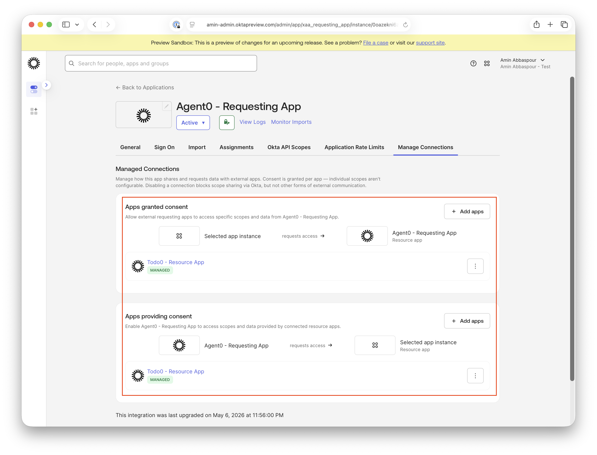

## Setup 5 - Assign Connection (Todo0) and Requesting (Agent0) Apps to User(s) in Okta
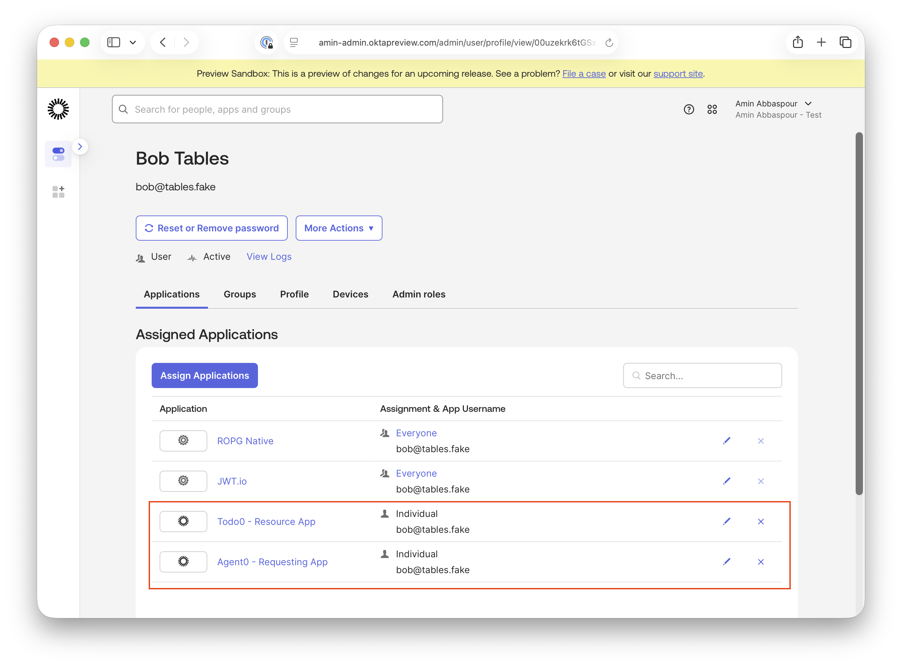

# Testing

## Step 0 - Environment Variables

Assign environment variables.

```bash
export auth0_domain='abbaspour.auth0.com'
export connection='xaa-idp'                           # Okta connection in Auth0 - step step 1 
export client_id='vlbB747IIDdNvkEqiNgUq5JNmIhH8bob'   # Agent0 in Auth0 - step step 3
export client_secret='PaAvicxxxxxJbxkMj4'             # Agent0 in Auth0 - step step 3

export okta_domain='amin.oktapreview.com'
export req_app_id='0oazekni6zXya9mh91d7'              # Agent0 in Okta - setup step 4 
export req_app_secret='ZFoR7xxxx-IRTc9cD'             # Agent0 in Okta - setup step 4
```

Run callback.sh to start listening.

```bash
./callback.sh
```

## Step 1 - Federate from Auth0 to Okta to provision Federated User (one time only)
```bash
./authorize.sh -d $auth0_domain -c $client_id -r $connection -u http://localhost:3000/cb -C 
```
Open the browser, paste the URL from clipboard and login with one of the users assigned to the app in setup step 5.
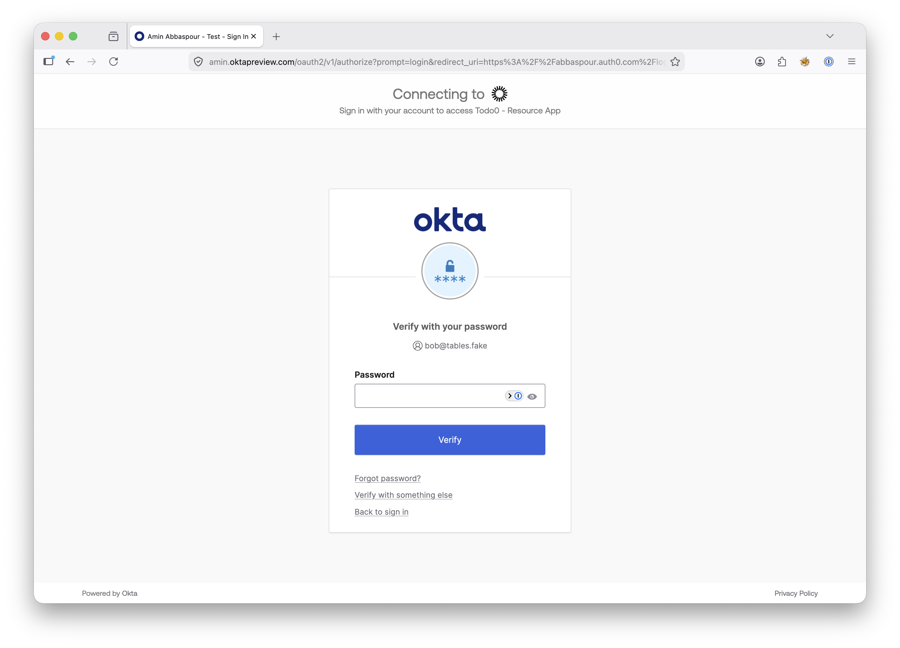

Once login is successful, user is provisioned in Auth0.
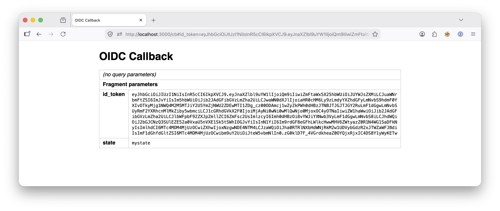
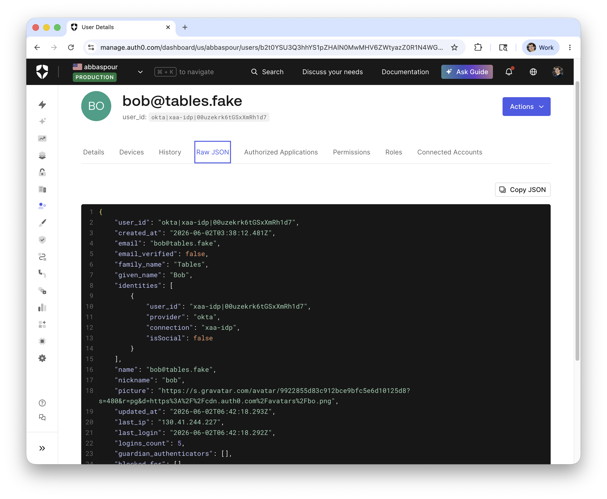

## Step 2 - Get id_token from Okta with Requesting App (agent0)

```bash

./authorize.sh -d $okta_domain -c $req_app_id -u http://localhost:3000/login/callback -C

export id_token='....'
```

Sample id_token from Okta will look like this:

```json
{
  "sub": "00uzekrk6tGSxXmRh1d7",
  "locale": "en-US",
  "email": "bob@tables.fake",
  "ver": 1,
  "iss": "https://amin.oktapreview.com",
  "aud": "0oazekni6zXya9mh91d7",
  "iat": 1780382948,
  "exp": 1780386548,
  "jti": "ID.Gaa4VzNszYAcLiFBVisDelmFvMsjR_UxKOD8nZfyrcQ",
  "amr": [
    "pwd"
  ],
  "idp": "00ocqzjhistjXcOWE1d7",
  "nonce": "mynonce",
  "sid": "idxKF0VoEs8TcixKJW_RwQLSQ",
  "preferred_username": "bob@tables.fake",
  "given_name": "Bob",
  "family_name": "Tables",
  "zoneinfo": "America/Los_Angeles",
  "updated_at": 1780288609,
  "email_verified": false,
  "auth_time": 1780382536
}
```

### Step 3 - Request ID-JAG using id_token

```bash

export id_jag=`./token-exchange.sh -d $okta_domain -c $req_app_id -x $req_app_secret \
  -i $id_token -a https://$auth0_domain/ -r urn:todo0:api -p -J | jq -r .access_token`
```

Here is a sample full payload of an exchange result 
```json  
{
  "token_type":"N_A",
  "expires_in":300,
  "access_token":"eyJraWQ....10zjUw",
  "issued_token_type":"urn:ietf:params:oauth:token-type:id-jag"
}
```  

And here is a sample decoded ID-JAG JWT

```json
{
  "jti": "IDAAG.agk1Ey5Rx64q18AF4uL0z5b-7ij-eV6JLlVYMSpf-yo",
  "iss": "https://amin.oktapreview.com",
  "aud": "https://abbaspour.auth0.com/",
  "iat": 1780371959,
  "exp": 1780372259,
  "sub": "00uzekrk6tGSxXmRh1d7",
  "resource": "urn:todo0:api",
  "email": "bob@tables.fake",
  "client_id": "vlbB747IIDdNvkEqiNgUq5JNmIhH8bob"
}
```

### Step 4 - Request access_token using ID-JAG

```bash

./token-exchange.sh -d $auth0_domain -c $client_id -x $client_secret -G jwt-bearer -s s1 -A $id_jag
```

Produced following access_token:

```json
{
  "iss": "https://abbaspour.auth0.com/",
  "sub": "okta|xaa-idp|00uzekrk6tGSxXmRh1d7",
  "aud": "urn:todo0:api",
  "iat": 1780374867,
  "exp": 1780461267,
  "jti": "eKy5GYdaz4AscG68xbJ1cm",
  "client_id": "vlbB747IIDdNvkEqiNgUq5JNmIhH8bob"
}
```

# References
- [Auth0 Cross App Access (XAA)](https://auth0.com/docs/secure/call-apis-on-users-behalf/xaa)
- [Build Secure Agent-to-App Connections with Cross App Access (XAA)](https://developer.okta.com/blog/2025/09/03/cross-app-access#use-okta-to-secure-ai-applications-with-oauth-20-and-openid-connect-oidc)
- [auth0-cross-app-access-inspector](https://github.com/auth0-samples/auth0-cross-app-access-inspector)